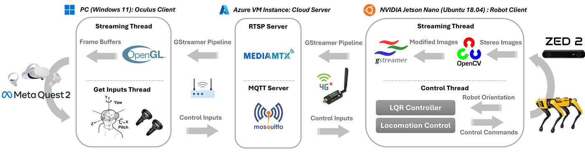
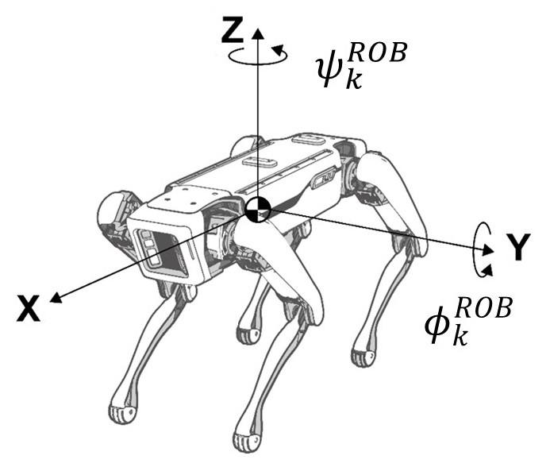
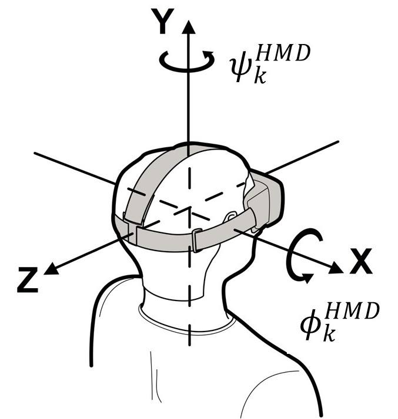

System architecture
===================

The architecture comprises three nodes: the **robot client**, the
**cloud server**, and the **Oculus client**.

   System architecture.
   (1) Robot client: streaming thread for video acquisition and a control
   thread for head-orientation tracking and locomotion.
   (2) Cloud server: RTSP for video and MQTT for control.
   (3) Oculus client: streaming thread for video feedback and an input
   thread for HMD and thumbstick commands.

Robot client
------------

Spot carries an NVIDIA Jetson Nano in a 3D-printed payload case together
with a ZED 2, a power module, and a SIM7600G-H 4G dongle.

**Streaming thread**

* Captures stereo images from the ZED 2 at :math:`1280 \times 720` and
  :math:`60\,\mathrm{fps}` in OpenCV format.
* Adjusts the frames so the displayed field of view is comparable to the
  stock Spot tablet (fair comparison in the user study).
* Injects frames into the GStreamer transmitter pipeline
  (see :doc:`streaming`).
* Reaches the cloud through the 4G dongle.

**Control thread**

* Subscribes to MQTT topic ``oculus/inputs``.
* Runs head-orientation tracking (LQR) and locomotion (dead-zone
  thumbstick map).
* An inner loop measures robot orientation from the Boston Dynamics
  state service and applies the orientation commands through the
  whole-body controller.

Entry point: ``scripts/spot_client/spot_client.py``.

If the 4G interface drops, the client restarts the ``simcom_wwan``
service and waits before resuming commands.

Cloud server
------------

A Google Cloud or Microsoft Azure virtual machine with a public IPv4
address hosts:

* **MediaMTX** — RTSP server. Default publish/play URL used by the
  clients::

      rtsp://<public-ip>:8554/spot-stream

* **Mosquitto** — MQTT broker on port 1883. Control topic::

      oculus/inputs

  Payload: a JSON array of six floats
  ``[pitch, yaw, roll, stick_x, stick_y, stick_rot]`` published at
  :math:`20\,\mathrm{Hz}` (50 ms period in ``oculus_client.py``).

Oculus client
-------------

A Windows 11 PC is tethered to a Meta Quest 2 HMD and controllers.
The evaluation machine was an ASUS G713PI (AMD Ryzen 9 7845HX, NVIDIA
GeForce RTX 4070, 16 GB RAM). Two threads run on the PC:

* **Streaming thread** (``src/main.cpp``, executable
  ``ZED Stereo Passthrough``) — pulls the RTSP stream through GStreamer,
  decodes H.264, and renders left/right images to the HMD with OpenGL
  and the Oculus PC SDK.
* **Input thread** — reads HMD IMU measurements and thumbstick axes and
  writes a 6-float binary record to a Windows named pipe
  ``\\.\pipe\MyPipe``. ``scripts/oculus_client.py`` reads that pipe and
  publishes JSON to MQTT.

Coordinate frames
-----------------

Frame definitions for the Spot base (left) and the HMD (right).
Pitch in the HMD frame is defined in the opposite direction of the
robot body-fixed pitch, which is why the LQR reference uses
:math:`-\phi_k^{\mathrm{HMD}}`.

See Boston Dynamics
`geometry and frames <https://dev.bostondynamics.com/docs/concepts/geometry_and_frames.html>`_
and Meta
`sensor documentation <https://developer.oculus.com/documentation/native/pc/dg-sensor/>`_.
