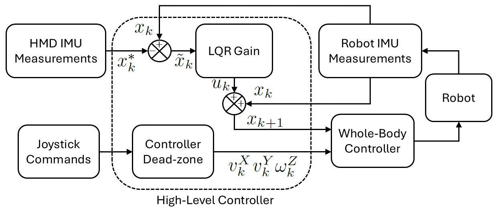
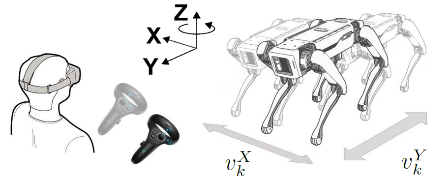
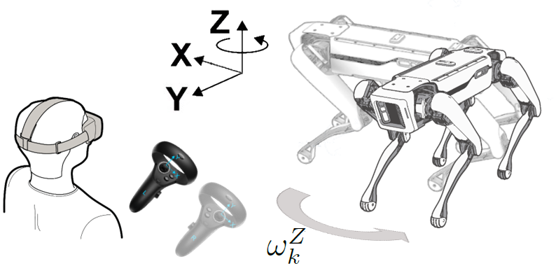

High-level controller
=====================

Spot's whole-body controller is treated as a black box. The high-level
layer only commands torso pitch/yaw and heading-frame velocities.

   Block diagram of the control system. HMD and robot IMU measurements
   feed an LQR; joystick commands pass through a dead-zone policy.
   Both outputs go to the same whole-body controller.

Torso-orientation task (2 DoF)
------------------------------

The task tracks the pitch and yaw of the robot body-fixed frame at
step :math:`k`,

.. math::

   \phi_k^{\mathrm{ROB}},\qquad \psi_k^{\mathrm{ROB}},

using the HMD IMU angles :math:`\phi_k^{\mathrm{HMD}}` and
:math:`\psi_k^{\mathrm{HMD}}` as references. **Roll is ignored.**

Because the low-level controller is a black box, the simplified
discrete-time model is the integrator

.. math::

   x_{k+1} = A x_k + B u_k,

with :math:`A = B = I^{2\times 2}`, state

.. math::

   x_k = \begin{bmatrix} \phi_k^{\mathrm{ROB}} \\ \psi_k^{\mathrm{ROB}} \end{bmatrix},

and :math:`u_k \in \mathbb{R}^{2}`. Pitch in the HMD frame has the
opposite sign, so the desired state is

.. math::

   x_k^{\ast} = \begin{bmatrix} -\phi_k^{\mathrm{HMD}} \\ \psi_k^{\mathrm{HMD}} \end{bmatrix}.

The tracking error is :math:`\tilde{x}_k = x_k - x_k^{\ast}`.

LQR
~~~

An infinite-horizon discrete LQR minimises

.. math::

   J = \frac{1}{2} \sum_{k=0}^{\infty}
       \bigl( \tilde{x}_k^{\!T} Q \tilde{x}_k + u_k^{\!T} R u_k \bigr),

with :math:`Q, R \in \mathbb{R}^{2\times 2}`. In the implementation
(``spot_controller.py``)

.. math::

   Q = 10\, I_2,\qquad R = I_2,

and the sample time is :math:`t_{\mathrm{step}} = 0.05\,\mathrm{s}`.
The control law is :math:`u_k = K \tilde{x}_k` with

.. math::

   K = -(B^{\!T} P B + R)^{-1} B^{\!T} P A,

where :math:`P \succ 0` solves the discrete algebraic Riccati equation

.. math::

   P = Q + A^{\!T} P A
       - A^{\!T} P B \bigl(R + B^{\!T} P B\bigr)^{-1} B^{\!T} P A.

The LQR object is built with ``do_mpc.controller.LQR`` on a
``do_mpc.model.LinearModel`` whose right-hand side is
:math:`x^{+} = x + u`.

Saturation
~~~~~~~~~~

Before commands reach the whole-body controller they are clipped to
joint-safe limits:

.. math::

   \lvert \phi_k^{\mathrm{ROB}} \rvert \le 0.52\,\mathrm{rad},\qquad
   \lvert \psi_k^{\mathrm{ROB}} \rvert \le 0.52\,\mathrm{rad}.

In code the constants are ``MAX_PITCH = MAX_YAW = 0.5`` rad
(``spot_interface.py``).

Locomotion task (3 DoF)
-----------------------

   Linear velocity components :math:`v_k^{X}`, :math:`v_k^{Y}` in the
   heading frame.

   Rotational velocity :math:`\omega_k^{Z}` about the vertical axis of
   the heading frame.

Thumbstick mapping (``Controller.get_touch_controls``):

* If the **right** stick axis exceeds the dead zone
  ``INPUT_TRESHOLD = 0.5``, a saturated value
  ``+/- VELOCITY_BASE_SPEED`` (``0.5 m/s``) is assigned to
  :math:`v^{X}` or :math:`v^{Y}`.

* The **left** stick is mapped the same way onto
  :math:`\omega^{Z}` with ``VELOCITY_BASE_ANGULAR = 0.5`` rad/s.

Commands last ``VELOCITY_CMD_DURATION = 0.6`` s on the SDK side so a
dropped packet does not leave the robot walking indefinitely.

Parallel execution
------------------

The two tasks run in the same control loop:

.. code-block:: python

   hmd_inputs = self.inputs[0:3]
   self.controller.get_setpoints(hmd_inputs)
   touch_inputs = self.inputs[3:6]
   spot_measures = self.interface.get_body_orientation()
   hmd_controls = self.controller.get_hmd_controls(spot_measures)
   touch_controls = self.controller.get_touch_controls(touch_inputs)
   controls = hmd_controls + touch_controls
   self.interface.set_controls(controls)

The robot can therefore walk while the operator looks around, with
torso orientation independent of walking direction.
