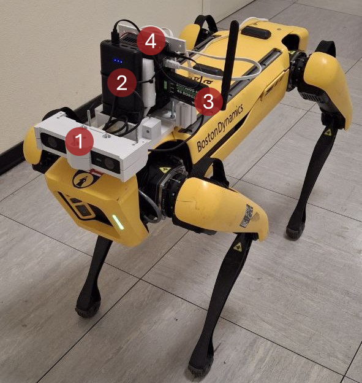

Immersive Spot Teleoperation
============================

Modular software for **immersive teleoperation** of the Boston Dynamics
Spot quadruped using a Meta Quest 2 head-mounted display (HMD).
The operator commands torso attitude from head orientation and planar
locomotion from handheld thumbsticks, while stereo video from a ZED 2
camera is streamed over RTSP through a public-IP cloud relay.

This documentation is written from the *Technical approach* section of
the manuscript *Design and User Evaluation of an Immersive Teleoperation
System for a Quadruped Robot* and from the source tree of
`github.com/aliy98/immersive-spot-teleoperation
<https://github.com/aliy98/immersive-spot-teleoperation>`_.

   Spot with the payload used in this work, mounted in a 3D-printed case:
   (1) ZED 2 stereo camera, (2) power supply, (3) SIM7600G-H 4G dongle,
   and (4) NVIDIA Jetson Nano.

What the system does
--------------------

* **Torso-orientation tracking** — an infinite-horizon LQR maps HMD pitch
  and yaw onto the robot body-fixed frame so the operator can look around
  without interrupting walking.
* **Locomotion** — right/left Quest thumbsticks map to heading-frame
  linear velocities :math:`v^X, v^Y` and yaw rate :math:`\omega^Z`.
* **Real-time stereo video** — a GStreamer pipeline with NVIDIA hardware
  H.264 encoding publishes an RTSP stream to MediaMTX; the Windows
  client decodes and renders to the HMD with OpenGL.
* **Long-range link** — MQTT (Mosquitto) carries control at 20 Hz and
  RTSP carries video through a cloud VM; the robot uses 4G rather than
  site Wi-Fi.

The torso-orientation task (2 DoF) and the locomotion task (3 DoF) run
in parallel. That five-DoF combination is not available on the stock
Spot tablet, which has only two thumbsticks.

.. toctree::
   :maxdepth: 2
   :caption: Contents

   overview
   architecture
   control
   streaming
   installation
   usage
   api
   citing

Authors
-------

* Ali Yousefi — ali.yousefi@edu.unige.it
* Carmine Tommaso Recchiuto — carmine.recchiuto@dibris.unige.it
* Antonio Sgorbissa — antonio.sgorbissa@unige.it

© 2025 RICE Lab — DIBRIS, University of Genova.
