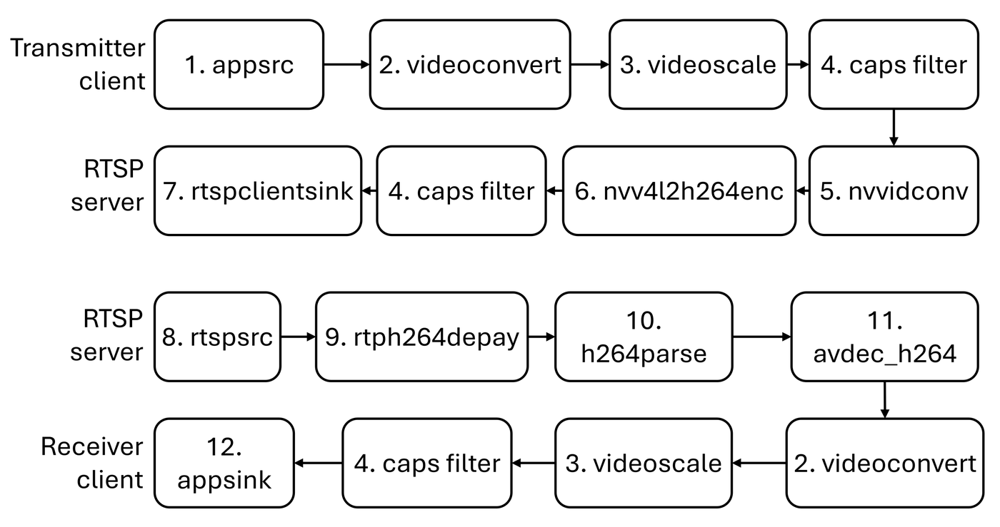

Real-time streaming
===================

Visual feedback uses RTSP. A transmitter client on the Jetson sends
encoded packets to MediaMTX; the Windows receiver pulls the same
stream. GStreamer builds both pipelines.

   GStreamer pipeline from the transmitter client to the RTSP server
   (top) and from the RTSP server to the receiver client (bottom).

Element key
-----------

======= =================== ===========================================
#       Element             Role
======= =================== ===========================================
1       ``appsrc``          Injects application frames
2       ``videoconvert``    Pixel-format conversion
3       ``videoscale``      Resize
4       ``capsfilter``      Enforces resolution / format
5       ``nvvidconv``       NVIDIA hardware converter
6       ``nvv4l2h264enc``   NVIDIA H.264 encoder
7       ``rtspclientsink``  Publishes to MediaMTX over TCP
8       ``rtspsrc``         Receives the RTSP stream
9       ``rtph264depay``    Extracts H.264 from RTP
10      ``h264parse``       Parses the H.264 bitstream
11      ``avdec_h264``      Software H.264 decoder
12      ``appsink``         Hands frames to the application
======= =================== ===========================================

Transmitter (Jetson)
--------------------

Implemented in ``stream_loop_zed`` inside ``spot_client.py``. After
capture and FoV adjustment the pipeline is:

.. code-block:: text

   appsrc !
     videoconvert ! videoscale !
     video/x-raw,format=GRAY8,width=1280,height=240,framerate=60/1 !
     nvvidconv !
     nvv4l2h264enc bitrate=3000000 !
     video/x-h264,stream-format=byte-stream !
     rtspclientsink protocols=tcp
       location=rtsp://<cloud-ip>:8554/spot-stream

Notes:

* Hardware encode on the Jetson (``nvv4l2h264enc``) keeps CPU and power
  low compared with a software encoder.
* The published size ``1280×240`` is the stacked / cropped stereo pair
  after the FoV match against the tablet controller.
* Bitrate is 3 Mbit/s, chosen to survive a 4G uplink.
* Transport is TCP so cellular packet loss does not tear the GOP.

Receiver (Windows)
------------------

The OpenCV / GStreamer receiver pipeline (bottom of the figure) is:

.. code-block:: text

   rtspsrc location=rtsp://<cloud-ip>:8554/spot-stream !
     rtph264depay ! h264parse ! avdec_h264 !
     videoconvert ! videoscale ! capsfilter !
     appsink

Decoded frames are uploaded as OpenGL textures and drawn by
``Shader`` (``include/Shader.hpp``, ``src/Shader.cpp``) into the
Oculus swap chain.

Why this stack
--------------

High-bandwidth stereo over a cellular hop is only practical with
hardware compression. Hosting MediaMTX on a public IP removes the need
for a site-to-site VPN or a reachable operator network, which is what
lets the same binary run from an office HMD to a robot in a harbour
yard.
